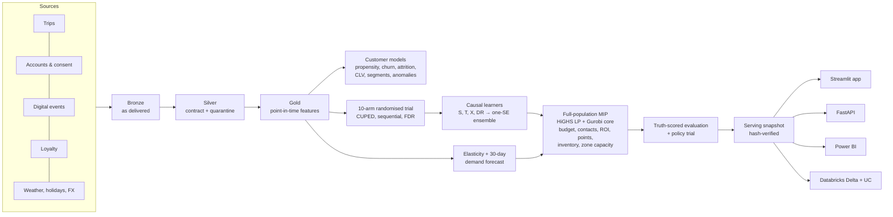

# Corridor: customer, pricing and transportation decision intelligence

Corridor decides which toll-road customers should get which promotion or loyalty reward, at what price,
without filling the highway at rush hour, and proves how much value the decision creates. It covers the
full loop a pricing and loyalty data science team owns: data contracts, customer models, a randomised offer
trial, causal targeting, a certified optimisation over the whole customer base, a test of the targeting
policy itself, monitoring, and the dashboards and services people use.

The data is synthetic and the company is fictional; nothing here is affiliated with 407 ETR. A simulator
with known ground truth is the point: it lets every targeting approach be scored against the true value of
its choices, which no real dataset allows.


## What the October plan decides

| | |
|---|---|
| Customers / eligible | 25,000 / 17,059 (consent, My Account, no past-due balance, active) |
| History | 3,680,249 trips, 1,412,304 digital events, 4,147 bad trips quarantined |
| Plan | 5,000 contacts and $10,000 of incentives, chosen among nine offers by one mixed-integer program over **112,563** customer-offer decisions |
| Certificate | Proven optimal (gap 1.5e-7 to the LP bound); **Gurobi** independently re-solved the residual and confirmed it |
| Expected value | $42,649: 30-day net contribution after incentives, plus discounted margin on days 31-90, plus congestion relief |
| **True value (simulation)** | **$64,774, 75% of what a perfectly informed planner reaches** |
| Propensity targeting, same budget | $6,278, 7% of the ceiling |
| Policy test | The targeting policy itself randomised against business as usual: **+$1.40 per customer** (95% CI $0.23 to $2.57) |
| Rush hour | A net 86 extra trips per workday moved onto the 407 at peak, only where free-flow capacity allows |

The headline finding is the one that makes the method matter: **the customers most likely to travel are not
the ones an offer moves** (propensity vs true incremental value, Spearman −0.47). Targeting on propensity
spends most of the budget discounting trips that would have happened anyway.

## How it works



| Stage | Method | Code |
|---|---|---|
| Data | Bronze/silver/gold with four planted feed defects; 39 point-in-time features in SQL | `data.py`, `sql/customer_features.sql`, `features.py` |
| Customer models | XGBoost / gradient boosting / logistic bake-off, Platt-calibrated on a separate fold; K-means and a BIC-selected Gaussian mixture; Isolation Forest | `models.py` |
| Experiment | Blocked randomisation, balance and SRM checks, CUPED, simulation-calibrated O'Brien-Fleming boundaries, Bonferroni and Benjamini-Hochberg | `experiments.py` |
| Causal targeting | Learners estimate incremental trips per travel period; offer terms turn trips into money; the production ensemble is every learner within one standard error of the best doubly robust validation loss | `causal.py`, `economics.py` |
| Pricing and demand | Empirical-Bayes elasticities from randomised prices; 30-day demand forecast with split-conformal intervals | `models.py`, `forecasting.py`, `pricing.py` |
| Optimisation | Exact MIP: LP bound, rounding, reduced-cost fixing, exact core; shadow prices, budget frontier, a risk-averse plan on lower confidence bounds, a joint price and campaign solve | `optimization.py` |
| Evaluation | Every approach scored against the simulator's truth; winner's-curse and calibration reporting; an independent policy trial | `evaluation.py`, `policy_trial.py` |

Every method choice, including the ones that were tried and rejected, is in [`DECISIONS.md`](DECISIONS.md).

## Where it runs

| Surface | What it is | Verified by |
|---|---|---|
| **Streamlit app** | Twelve pages: decision centre with live re-solves, next best offer per customer, pricing, segments, offers and loyalty, transportation, policy value, experiments, model operations, operations centre, analyst workbench | `tests/test_app.py` renders every page |
| **FastAPI** | Decision service with API keys, health and readiness probes and a bounded scenario solver | `tests/test_api.py` |
| **Power BI** | Generated PBIP: 9 pages, 118 visuals, 94 documented measures, SVG tiles and nine HTML/CSS panels (HTML Content visual) | All 149 measures executed against Power BI's engine (`scripts/validate_powerbi_model.ps1`); byte-for-byte drift gate in CI |
| **Databricks** | Four-task serverless job: pipeline with Gurobi and workspace MLflow → Delta medallion with CHECK constraints and a PySpark feature-parity gate → Unity Catalog model registry → reconciled publish and a run receipt | All four notebooks run locally by `databricks/local_run.py`; see [`databricks/README.md`](databricks/README.md) for the hosted run |
| **AWS SageMaker** | Pipeline definition: Processing, Training, held-out Evaluation, quality gate, Model Registry (pending approval), Batch Transform | Stages run locally (`scripts/verify_cloud_stages.py`); not executed in AWS |

## Run it

The repository ships a hash-verified serving snapshot, so the app opens without rebuilding anything.

```powershell
python -m venv .venv
.\.venv\Scripts\python.exe -m pip install -r requirements-runtime.txt
.\.venv\Scripts\python.exe -m pip install --no-deps -e .
.\.venv\Scripts\python.exe -m streamlit run app.py
```

Rebuild everything from the simulator (about 8 minutes at 25,000 customers):

```powershell
.\.venv\Scripts\python.exe -m pip install -e ".[dev,app,api,ml,tracking,gurobi,advanced]"
.\.venv\Scripts\python.exe -m decision_platform.cli demo
.\.venv\Scripts\python.exe -m pytest -q
```

Power BI: open `powerbi/project/Corridor.pbip` in Power BI Desktop. The data is embedded, so it opens with no
credentials. Regenerate it after a pipeline run with `python -m decision_platform.bi.build_pbip`.

Databricks: `databricks bundle deploy && databricks bundle run corridor`, or without the CLI,
`python databricks/run_job.py --host https://<workspace>.cloud.databricks.com` (browser sign-in, no token).

## Evidence

- **Tests.** 200+ tests: data contracts, leakage, brute-force optimality on small instances, every app page,
  the API, the Power BI model's references, the registry scorer reproducing the plan's effects to 1e-9.
- **Release gate.** Evaluated on every run (`quality.py`): calibrated classifiers beat their baselines on an
  untouched later fold, demand beats the seasonal baseline with interval coverage ≥ 80%, held-out uplift
  Qini above zero; and, as simulation-only checks, the plan reaches ≥ 60% of the ceiling and elasticity
  intervals cover the truth in ≥ 80% of cells. At 3,000 customers (300 per trial arm) it fails, correctly.
- **Two engines, one feature contract.** PySpark recomputes all 39 features from silver and matches DuckDB to
  2.2e-11 on 3.7 million trips (`scripts/benchmark_spark.py`, and as a gate inside the Databricks job).
- **Power BI.** Every measure executed against the engine; HTML panels rendered from the engine's output and
  checked for overflow (`scripts/preview_powerbi_html.py`).

## For the role

[`docs/role-coverage.md`](docs/role-coverage.md) maps each responsibility and qualification in the Data
Scientist posting to the code and evidence here. Supporting documents written as the role would write them:
[A/B testing playbook](docs/ab-testing-playbook.md), [data platform plan for IT](docs/data-platform-plan.md),
[project plan with stakeholders and RACI](docs/project-plan.md).

## Limitations

- Synthetic data. The simulator is designed to be realistic, not calibrated to a real operator.
- The causal learners under-state value in level (mean bias −$4.49 per customer-offer), so expected value
  sits below true value. Ranking is what the plan depends on. A BLP recalibration is computed as a diagnostic
  and not applied: when first tested it raised bias on 7 of 8 offers, and in this run it would only move the
  mean bias to −$3.86.
- Gurobi runs under its size-limited licence: it solves or verifies cores up to 2,000 variables and
  constraints, HiGHS solves the larger ones, and the certificate says which did what.
- SageMaker is defined and locally exercised, not run in AWS.

See [`docs/limitations.md`](docs/limitations.md) for the full list.
