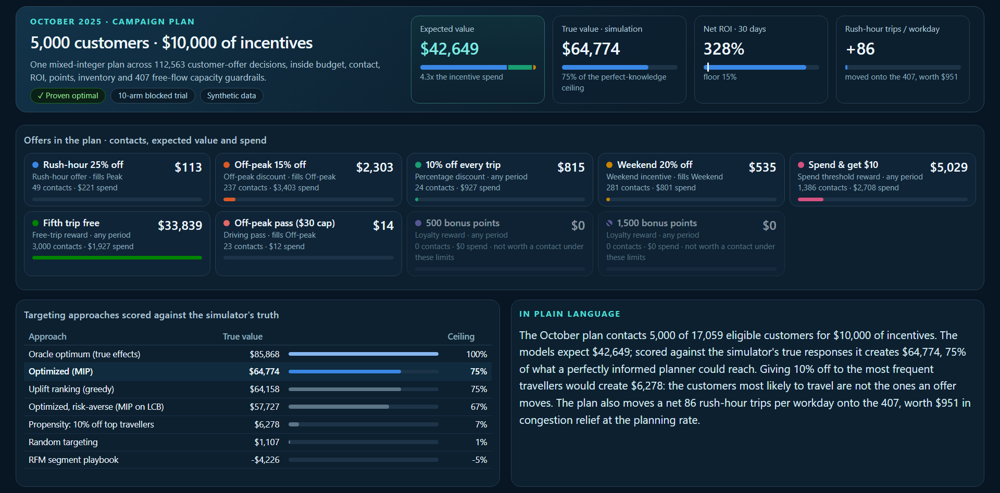

# Power BI report

`project/Corridor.pbip` is a Power BI project generated from code: open it in Power BI Desktop and it loads
with no data path and no credentials, because each table's rows are embedded in its query.

| | |
|---|---|
| Pages | 9: Command centre, October plan, Campaign contacts, Customers, Transportation and capacity, Pricing, Experiments, Policy value, Operations |
| Visuals | 97, every one with alt text |
| Model | 24 tables, 16 relationships, 101 documented measures ([reference](../docs/power-bi-measures.md)), plus SVG header and HTML panel measures |
| HTML and CSS panels | 17: a KPI strip on each of the eight analysis pages and nine panels, drawn by the [HTML Content](https://github.com/dm-p/powerbi-visuals-html-content) visual from DAX measures that return markup, styled by one shared stylesheet |



## The HTML panels

| Panel | Page | Why HTML |
|---|---|---|
| KPI strip | Every analysis page | Each KPI carries a status pill in words and a micro-visual: progress against its limit, value against a target, the parts of a total, a mini trend, an interval or check dots |
| Hero banner with four KPIs and the optimality badge | Command centre | One composed banner instead of five visuals |
| Offer cards: mechanic, period, value, contacts, spend, share bar | Command centre | Nine cards with inline bars; idle offers dimmed and labelled |
| Policy leaderboard against the perfect-knowledge ceiling | Command centre | Ranked table with inline bars and the production plan highlighted |
| Narrative | Command centre | The executive summary measure as readable type |
| Guardrails with LP shadow prices | Policy value | The limit most worth relaxing, stated in a sentence |
| Experiment forest plot | Experiments | Point estimates with Bonferroni intervals and a zero line: not a native visual |
| Capacity heat grid | Transportation | Zone × period load with free trips in each cell; amber at 80% |
| Segment table with plan-share bars | Customers | Responds to the zone and tier filters |
| Release scorecard | Operations | Gate checks and model quality in one panel |

Native visuals remain wherever cross-filtering matters (bar, line and column charts, tables, slicers). The
HTML Content visual is an AppSource custom visual listed in `report.json`; Desktop fetches it when the
report opens.

## Rebuild and verify

```powershell
python -m decision_platform.cli export-bi          # powerbi/data/*.csv from the serving snapshot
python -m decision_platform.bi.build_pbip          # regenerate the project and docs/power-bi-measures.md
python -m decision_platform.bi.build_pbip --check  # CI: fail on any byte of drift
```

With Power BI Desktop open (an empty instance is enough):

```powershell
powershell -File scripts/validate_powerbi_model.ps1   # TMDL parse, deploy, refresh, execute every measure
python scripts/preview_powerbi_html.py              # render the HTML panels at their positions; flag overflow
```

`validate_powerbi_model.ps1` deploys the model as a scratch database into the running Desktop's engine,
refreshes it, executes every measure and drops the database again. It is how the apostrophe in
`Winner's curse` was found: unescaped in TMDL, it stopped Desktop opening the model at all.

`tests/test_powerbi.py` checks, without Power BI, that every column and measure a measure or a visual names
exists, that the stylesheet and markup are quote-safe, and that the committed project matches the spec.
